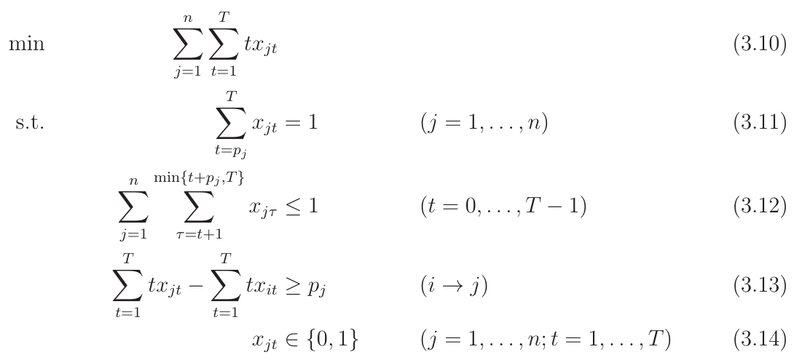
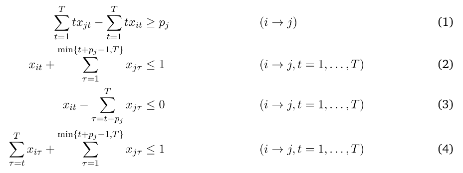

# 1 | prec | sum C_j
=====================================================

Exact solution for the 1 | prec | sum C_j scheduling problem using a CPLEX implementation of the following MIP formulation.

**********************************



The precedence relations are implemented in four different ways and compared with regard to their efficiency:



### DEPENDENCIES
- **CPLEX (latest - academic license)**

### BUILD PROCESS (IntelliJ IDEA)
```
Build -> Build Artifacts -> TotalFlowTimeMinimizer.jar
```

### RUN .jar and dynamically link CPLEX
```
$ java -jar -Djava.library.path="/opt/ibm/ILOG/CPLEX_Studio1210/opl/bin/x86-64_linux/" TotalFlowTimeMinimizer.jar
